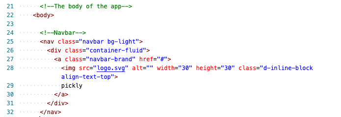

# Pickly

#### Video Demo: https://youtu.be/TfmEobgGANU

#### Description: Pickly is a decision making web application for decisions in which all choices have equal merit.

Written in HTML, CSS and Javascript I wrote Pickly to be as efficient as possible, requiring no back-end processing.

I am using CS50's codespace to host the website for the purpose of demonstration.

In the head of the HTML I have made sure to include the unicode character set and set the viewport to adjust to the device width.

Also in the head I've linked to Bootstrap's Javascript and CSS modules, as well as my own CSS File.

The navbar is a bootstrap module using my own SVG graphic I produced.

Here is the div, specifying the class as "header" to set display preferences in CSS.

I created a class called container to further set preferences for divs inside it.

Here is the textbox for user input, I used bootstrap's module that includes a button.

This is the div for displaying a "list group", the list group class is a module from bootstrap.

Next are the divs I've created a class for use with buttons, and button class modules from bootstrap.

A simple footer div.

The javascript for Pickly is embedded in the bottom of the body of the HTML, first I establish an empty array.

From there I use the addEventListner function to gather input from the user, with an if-condition using the trim function to check for a blank choice. Else, I add the user's input into the array.

Next function is for resetting the list, using addEventListener to 'listen' for the click on the reset button. When clicked, the input array is re-assigned the value of a blank array.

For the final function I use addEventListener again to 'listen' for a click on the choose button. I use an if-else statement to check if the user is trying to choose without adding a choice first, if yes then I return an error. Else, I create a variable called 'randomItem' which is assigned the value of the array using javascript's built in math modules to produce a random element in the array.

